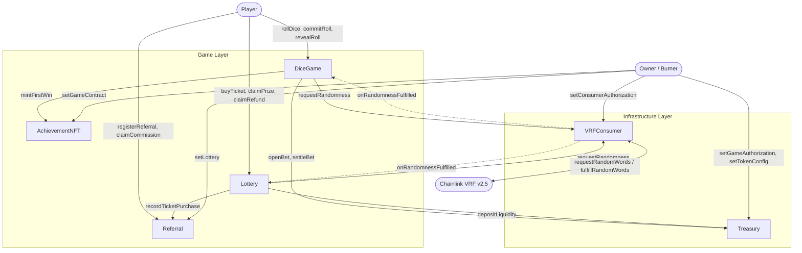
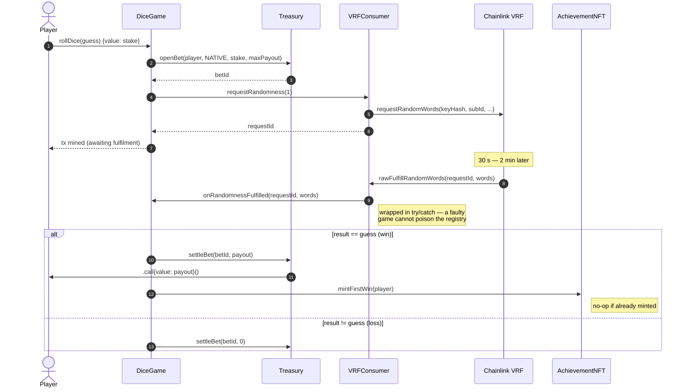
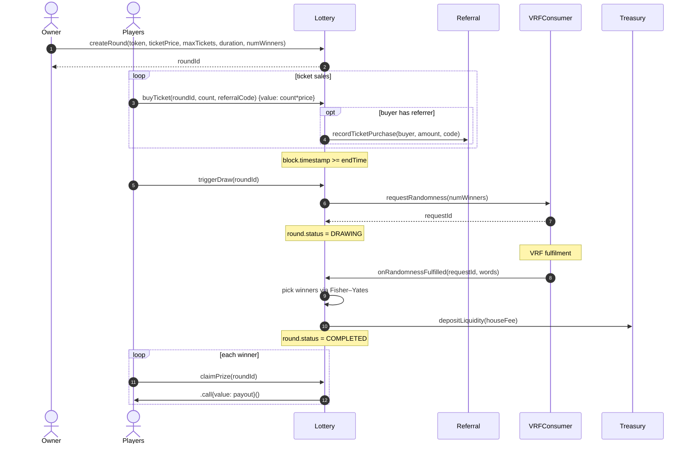

# System Architecture

**Project:** SC6107 — On-Chain Verifiable Random Game Platform
**Last updated:** May 2026

This document describes the contract topology, runtime data flows, trust boundaries, and core design decisions of the platform. It is the canonical reference for what calls what and why.

---

## 1. Overview

The protocol is six on-chain contracts organised into two layers.

The **infrastructure layer** (`VRFConsumer`, `Treasury`) is game-agnostic. It encapsulates the only two cross-cutting concerns every game needs: verifiable randomness from Chainlink VRF v2.5, and a shared escrow that holds player stakes and pays out winners under a unified solvency invariant.

The **game layer** (`DiceGame`, `Lottery`, `AchievementNFT`, `Referral`) consumes the infrastructure through three narrow interfaces (`IVRFConsumer`, `IRandomnessConsumer`, `ITreasury`). Each game contract is responsible for its own rules and bookkeeping but never touches house funds directly — every value transfer flows through `Treasury`.

This separation lets new games be added without changing the infrastructure layer, and lets the infrastructure layer be audited once for the whole protocol rather than per-game.

## 2. Contract Catalogue

| Contract | Layer | Purpose |
|---|---|---|
| `VRFConsumer.sol` | Infra | Single Chainlink VRF v2.5 integration point. Wraps `VRFConsumerBaseV2Plus`, owns the subscription config, routes random words to the requesting game via `IRandomnessConsumer`, exposes a timeout-based retry path, and isolates consumer faults with `try/catch`. |
| `Treasury.sol` | Infra | House bank with the protocol's solvency invariant. Locks worst-case payouts on `openBet`, releases on `settleBet`, applies a configurable house edge (capped at 20%), and supports native ETH plus arbitrary ERC-20 tokens behind a uniform interface. |
| `DiceGame.sol` | Game | 1d6 dice game with two play modes: instant `rollDice(guess)` and a commit-reveal flow (`commitRoll` → `revealRoll`) that pre-binds the guess for MEV resistance. Mints a one-shot `AchievementNFT` on the player's first win. |
| `Lottery.sol` | Game | Pari-mutuel lottery with multiple winners per round, refund-on-cancel, and referral-fee carve-out. Tickets are purchased during a fixed window; the draw is triggered after `endTime` and resolved by Chainlink VRF. |
| `AchievementNFT.sol` | Game | ERC-721 NFT minted exactly once per address by `DiceGame` upon a first win. The `hasFirstWinAchievement` mapping makes idempotency cheap. |
| `Referral.sol` | Game | Off-chain-style referral commission tracker. Records ticket purchases from referred buyers via `recordTicketPurchase` (called by `Lottery`), accrues a 1% commission, and pays out on `claimCommission`. |

Interfaces under `src/interfaces/` are the only surface a new game contract should compile against: `IVRFConsumer` (request randomness), `IRandomnessConsumer` (receive randomness), `ITreasury` (open/settle bets), `IReferral` (record purchases).

## 3. System Diagram

Solid arrows are synchronous calls; dashed arrows are asynchronous VRF callbacks dispatched from `VRFConsumer` to the requesting game.

## 4. Dice Game Bet Lifecycle

The dice flow exercises the full infrastructure round-trip — stake escrow, VRF request, callback delivery, settlement, and (on a first win) NFT minting.

The commit-reveal variant inserts an extra step before the request: `commitRoll(commitment)` stores `keccak256(guess, salt)`, and only `revealRoll(requestId, guess, salt)` is allowed to resolve the bet. This prevents a player from learning the random word (e.g. via a malicious RPC) and choosing whether to reveal — they're bound to a guess before the VRF request fires.

## 5. Lottery Round Lifecycle

A lottery round is a longer-lived object than a dice bet: it opens, accumulates ticket sales, transitions to `DRAWING` on `triggerDraw`, and ends in either `COMPLETED` (winners can claim) or `CANCELLED` (buyers can refund).

If the VRF request is never fulfilled within `vrfTimeout` (24h), `retryDraw` can be called by anyone to re-request randomness. If the round was never drawn (e.g. owner abandoned it), `cancelRound` flips the status to `CANCELLED` and unlocks `claimRefund` for every ticket holder.

## 6. Trust Boundaries

Cross-contract authority is gated by explicit allowlists, all set by the contract owner. The matrix below lists who can call what.

| Resource | Guarded by | Authorised callers (production) |
|---|---|---|
| `VRFConsumer.requestRandomness` | `setConsumerAuthorization` | `DiceGame`, `Lottery` |
| `Treasury.openBet` / `settleBet` | `setGameAuthorization` | `DiceGame`, `Lottery` |
| `Treasury.depositLiquidity` | (open) | Anyone — funds the house |
| `Treasury.withdrawLiquidity` | `onlyOwner` | Owner only |
| `AchievementNFT.mintFirstWin` | `setGameContract` | `DiceGame` only (single binding) |
| `Referral.recordTicketPurchase` | `setLottery` | `Lottery` only (single binding) |
| Owner-only setters on every contract | `Ownable` / `Ownable2Step` | Owner key |

`Treasury` uses `Ownable2Step` for ownership transfers, reflecting its position as the most security-critical contract — accidental transfer of ownership would expose ~all house liquidity to the recipient.

## 7. Core Design Decisions

**Randomness via Chainlink VRF v2.5.** The protocol does not roll its own randomness primitive. Cheaper alternatives like block-hash-based RNG are vulnerable to validator manipulation in a low-value adversarial setting and provide no auditability. VRF v2.5 provides a cryptographic proof attached to every random word that the consumer wrapper verifies on-chain. The cost (≈0.0003 LINK per request) is acceptable for the game-prize sizes envisioned.

**`try/catch` around the VRF callback.** A naive `consumer.onRandomnessFulfilled(...)` would let a buggy or malicious game contract permanently brick the VRF pipeline — once `fulfillRandomWords` reverts in `VRFConsumer`, Chainlink retries are exhausted and the request is dead. The wrapper isolates each consumer with `try/catch`, marks the request `FULFILLED` regardless of consumer success, and exposes `getRandomWords(requestId)` so a faulty game can self-recover on a subsequent transaction. This is the single most important defensive pattern in the protocol.

**Two-mode dice game (instant + commit-reveal).** The instant path (`rollDice(guess)`) is cheap (~441k gas) and good enough when the player has a trusted RPC and no value is at stake. The commit-reveal path adds a one-block delay and ~30k extra gas but is immune to a malicious RPC reordering or simulating the VRF callback before submitting the player's reveal. Players choose; the protocol supports both.

**Solvency invariant as the protocol's safety property.** `Treasury` exposes `lockedLiquidity` as the sum of worst-case payouts across all open bets. The invariant `address(treasury).balance >= lockedLiquidity(token)` is enforced by construction: `openBet` increments locked by `maxPayout`, `settleBet` decrements it by the same `maxPayout` (releasing the entire reservation regardless of actual payout), and no other code path can decrement `balance` without going through `_payOut` which is gated by `nonReentrant`. The invariant was verified empirically under 64×32 randomised fuzz sequences and never violated.

**Pari-mutuel lottery, not fixed-prize.** Round prize is `totalTicketsSold * ticketPrice * (1 - houseEdge)`, not a posted constant. This removes the house's exposure to underwriting risk (a small round means small prize, never a loss) and aligns winner economics with participation. The trade-off is unpredictable prize size at ticket-purchase time, which is mitigated by displaying the running prize pool on the frontend.

**Fisher–Yates winner selection over modulo selection.** Selecting `numWinners` from `totalTicketsSold` tickets via repeated `words[i] % remaining` followed by a swap-out guarantees uniform selection without replacement using a single VRF request. The alternative (one VRF request per winner) costs `numWinners×` the LINK and `numWinners×` the latency.

**One NFT per player, ever.** `AchievementNFT.mintFirstWin` is a no-op if `hasFirstWinAchievement[player]` is already true. This makes the mint idempotent and protects the `DiceGame` settlement path from reverting on a second win.

**Native-token fast path in `Treasury`.** `token == address(0)` short-circuits the ERC-20 transfer logic and uses `msg.value` plus `.call{value:}` for payouts. This avoids ~30k gas per bet on the dominant code path (native ETH wagers) while keeping the ERC-20 path available for future token integrations.

## 8. Cross-References

- **Security analysis** → `docs/security-analysis.md`
- **Gas profile and optimization opportunities** → `docs/gas-optimization.md`
- **Live deployment record and operational guide** → `DEPLOYMENT.md`
- **Test coverage details** → `docs/coverage-report.txt`
- **Raw Slither output** → `docs/slither-report.txt`
- **Raw gas report** → `docs/gas-report.txt`

---

*SC6107 Group Project — System Architecture.*
